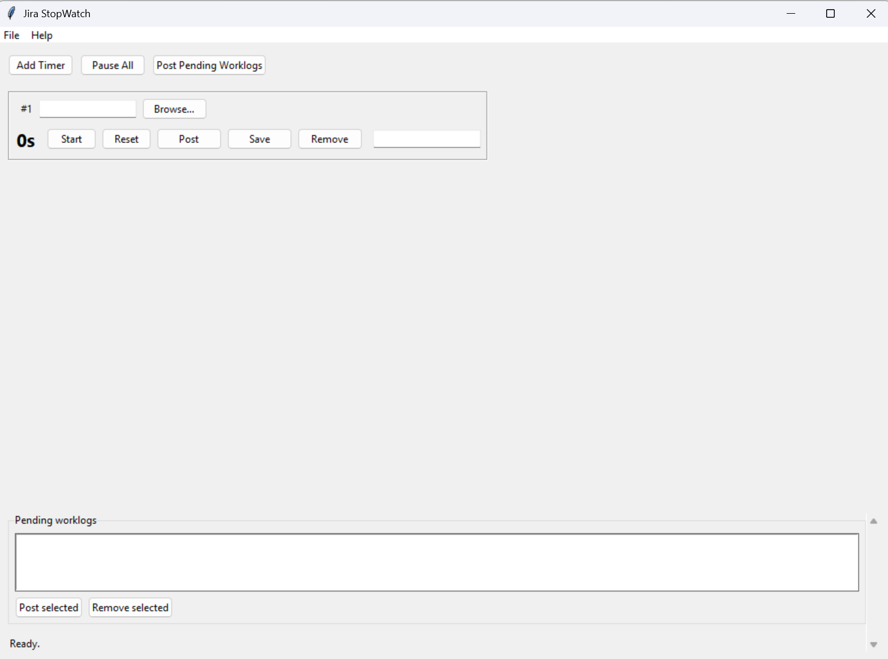
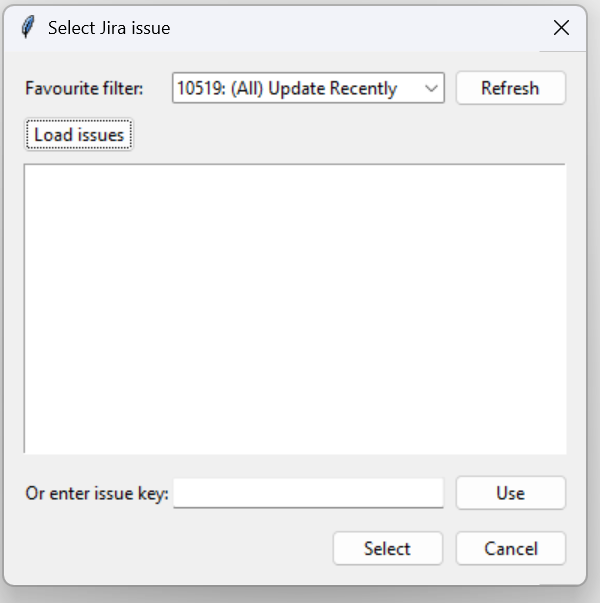
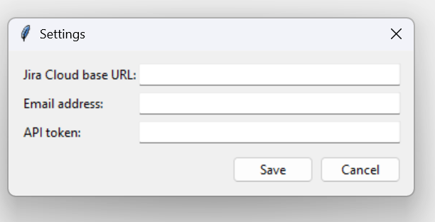

# JiraStopWatch-Python

[](https://www.python.org/downloads/release/python-310/)
[](https://opensource.org/licenses/MIT)
[](https://developer.atlassian.com/cloud/jira/platform/rest/v3/intro/)

**JiraStopWatch-Python** is a Python-based desktop application that allows users to log time entries against Jira Cloud issues based on tracked working hours. The application provides an intuitive interface for managing multiple timers, posting worklogs and maintaining session data across restarts. Inspired by [JiraStopwatch](https://github.com/jirastopwatch/jirastopwatch)

---

## Getting Started

1. Install the dependencies using your preferred Python environment (Python 3.10+).

   ```bash
   pip install -r requirements.txt
   ```

2. Launch the desktop application:

   ```bash
   python -m jirastopwatch
   ```

3. Open **File → Settings** and provide your Jira Cloud base URL, email address and API token. Once saved, you can test the connection via **File → Test Connection**.

---

## Overview

JiraStopWatch-Python streamlines time-tracking and worklog submission for Jira Cloud users. It supports multiple concurrent issue timers, persistent state saving and secure API-based authentication.  
This tool is ideal for users who regularly switch between issues and require accurate, timestamped worklogs without manual Jira entry.

---

## Tracking Multiple Jira Issues



- Manage several time-tracking slots concurrently.  
- Log time in Jira’s native format (e.g., `2h 31m`).  
- Automatically save issue keys and timer states when exiting the application.

---

## Issue Selection



- Access issues using your favourite JQL filters.  
- Choose issues from lists generated via JQL queries or paste Jira URLs to auto-extract issue keys.  
- Quickly switch between filters or projects for efficient time tracking.

---

## Worklog Management

- Post tracked time directly to Jira as worklogs, complete with comments.  
- Save draft comments with timestamps for later posting.  
- Control remaining estimates manually or let Jira update them automatically.

This ensures every time entry is recorded accurately and accompanied by relevant context.

---

## Jira Integration



- Authenticate using secure Jira Cloud API tokens.  
- Display issue details automatically once a key is added.  
- Automatically transition issues to *In Progress* when timers start.  
- Submit time entries and comments directly via the Jira REST API.

---

## Time Tracking Features

- Switch between multiple active timers with a single click.  
- Add or remove tracking slots dynamically.  
- Manually adjust recorded time by double-clicking on time fields.  
- Pause timers automatically when your computer locks.  

These features ensure complete flexibility for accurate work tracking.

---

## Session Persistence

JiraStopWatch-Python automatically preserves critical data on exit:

- Jira API tokens (securely stored).
- Issue keys and timer states.
- Optional ongoing timer tracking across restarts.

---

## Appearance Options

- Toggle **View → Dark mode** to switch between the default system look and a darker palette.
- The preference is saved in your profile so the app reopens with the same theme you selected.

---

## Creating a Jira API Token

To authenticate with Jira Cloud, you must generate an API token. Follow these steps:

1. **Log in to your Atlassian account:**  
   Visit [https://id.atlassian.com/manage-profile/security/api-tokens](https://id.atlassian.com/manage-profile/security/api-tokens).

2. **Create a new API token:**  
   Click **Create API token**, provide a descriptive label (e.g., *JiraStopWatch-Python*), then select **Create**.

3. **Copy and store the token securely:**  
   Copy the generated token immediately, as it cannot be viewed again later.

4. **Configure JiraStopWatch-Python:**  
   In **File → Settings**, enter the following details:  
   - **Base URL**: Your Jira Cloud URL (e.g., `https://yourdomain.atlassian.net`)  
   - **Email**: Your Atlassian account email address  
   - **API Token**: The token you just created  

5. **Verify your connection:**  
   Use **File → Test Connection** to confirm that your Jira credentials and API access are working correctly.

---

## License

This project is distributed under the terms of the **MIT Licence**.  
For more details, see the [LICENSE](LICENSE) file.